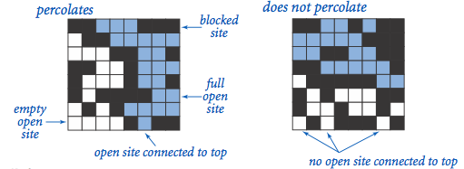

# Estimate The Percolation Threshold Using UnionFind QuickFind And QuickUnion
Given a composite systems comprised of randomly distributed insulating and metallic materials: what fraction of the materials need to be metallic so that the composite system is an electrical conductor? Given a porous landscape with water on the surface (or oil below), under what conditions will the water be able to drain through to the bottom (or the oil to gush through to the surface)? Scientists have defined an abstract process known as percolation to model such situations.

While nobody has successfully found the mathematical approach to solve the percolation problem, the result can be estimated by using computational power. In this notebook, I estimated the percolation thresholds by using three different algorithms: UnionFind, QuickFind, and QuickUnion, and compared their process times. 

## Version
- Java version 8.0

## Model
The model is defined as follow:
- The system is simulated as a NxN grid of sites, initially set as "blocked".
- At every step, a random site can be "open", and if any of its neighboring site is also "open", they will be connected.
- They system is said to be "percolated" if the top of the grid and the bottom of the grid are connected by open sites.

*empty open site: open site not connected to top; full open site: open site connected to top*

## Result
The results are shown as follow, where
- N: number of row/column of the grid
- mean_percolation_threshold: the threshold that the system becomes percolated. e.g. if 200 sites out of 400 sites were open when the system percolates, the threshold is 200/400 = 0.5. Each value is shown as the mean of 100 independent trails.
- union_find_time (ms): process time using UnionFind algorithm in microseconds.
- quick_union_time (ms): process time using QuickUnion algorithm in microseconds.
- quick_find_time (ms): process time using QuickFind algorithm in microseconds.

